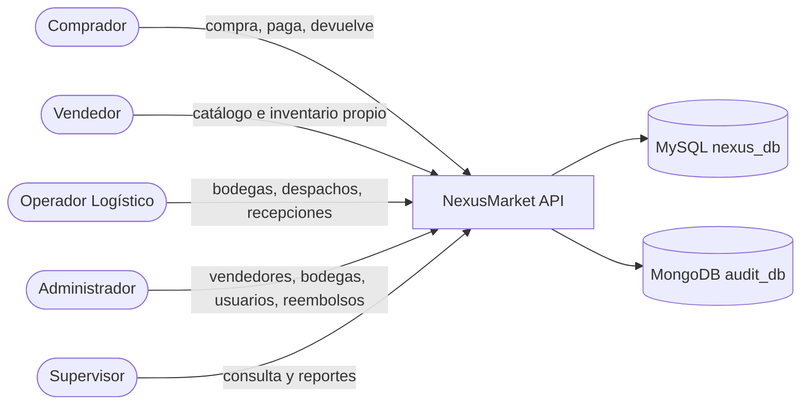

# Nivel 1 — Contexto

```mermaid
flowchart LR
    B([Comprador]) -->|compra, paga, devuelve| N[NexusMarket API]
    S([Vendedor]) -->|catálogo e inventario propio| N
    L([Operador Logístico]) -->|bodegas, despachos, recepciones| N
    A([Administrador]) -->|vendedores, bodegas, usuarios, reembolsos| N
    V([Supervisor]) -->|consulta y reportes| N
    N --> DB[(MySQL nexus_db)]
    N --> AU[(MongoDB audit_db)]
```

Cada actor tiene un único rol (RG-02) y solo accede a su puerto de entrada (RG-03).
