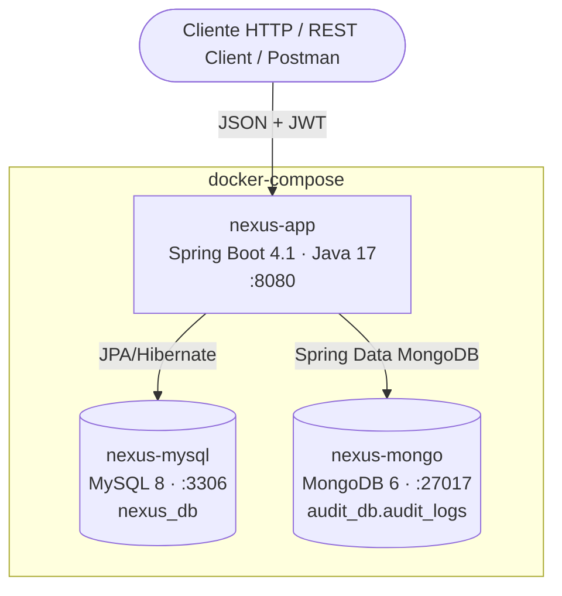

# Nivel 2 — Contenedores

```mermaid
flowchart TB
    subgraph docker-compose
      APP[nexus-app<br/>Spring Boot 4.1 · Java 17<br/>:8080]
      MY[(nexus-mysql<br/>MySQL 8 · :3306<br/>nexus_db)]
      MO[(nexus-mongo<br/>MongoDB 6 · :27017<br/>audit_db.audit_logs)]
    end
    C([Cliente HTTP / REST Client / Postman]) -->|JSON + JWT| APP
    APP -->|JPA/Hibernate| MY
    APP -->|Spring Data MongoDB| MO
```
