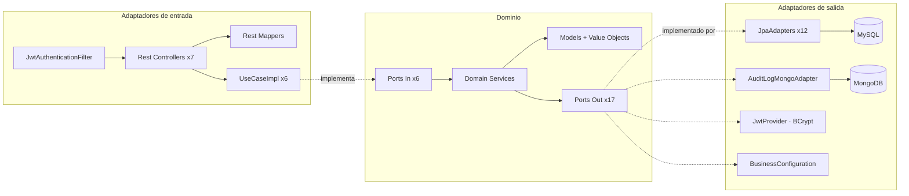

# Nivel 3 — Componentes

```mermaid
flowchart LR
    subgraph Adapters_in[Adaptadores de entrada]
      F[JwtAuthenticationFilter] --> RC[Rest Controllers x7]
      RC --> RM[Rest Mappers]
      RC --> UC[UseCaseImpl x6]
    end
    subgraph Domain[Dominio]
      PI[Ports In x6] --> SV[Domain Services]
      SV --> MD[Models + Value Objects]
      SV --> PO[Ports Out x17]
    end
    subgraph Adapters_out[Adaptadores de salida]
      JPA[JpaAdapters x12] --> MY[(MySQL)]
      MG[AuditLogMongoAdapter] --> MO[(MongoDB)]
      SEC[JwtProvider · BCrypt]
      CFG[BusinessConfiguration]
    end
    UC -.implementa.-> PI
    PO -.implementado por.-> JPA
    PO -.-> MG
    PO -.-> SEC
    PO -.-> CFG
```
