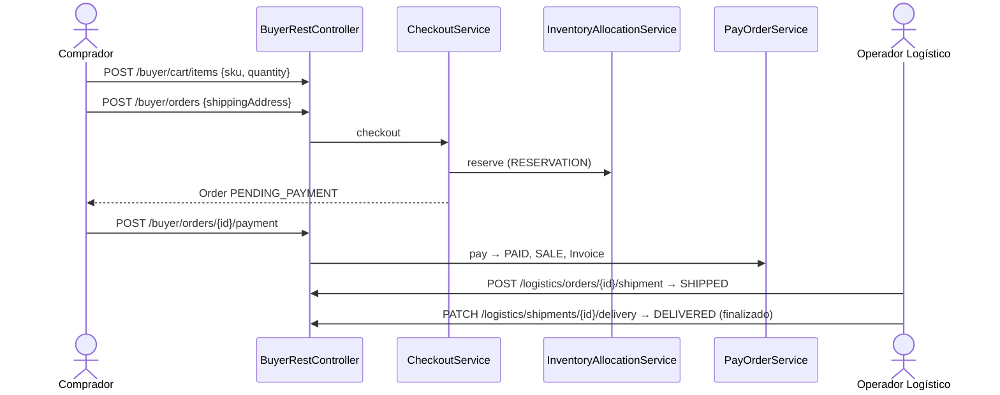
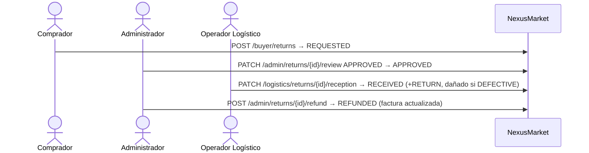
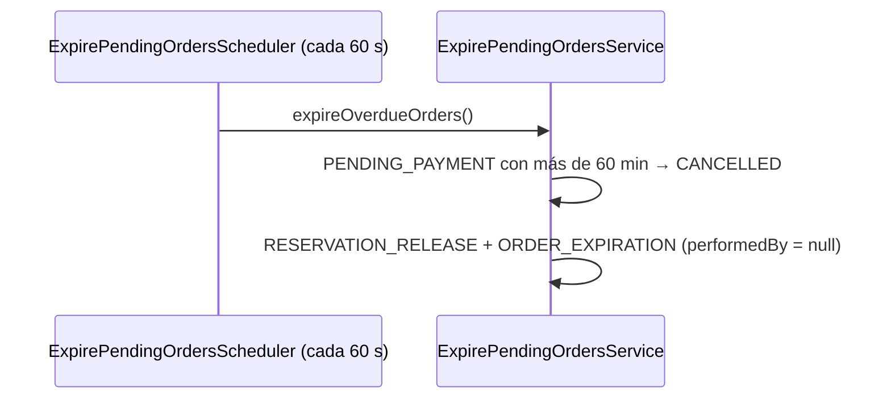

# Flujos principales

## Compra de un producto físico

```mermaid
sequenceDiagram
    actor B as Comprador
    participant API as BuyerRestController
    participant CO as CheckoutService
    participant INV as InventoryAllocationService
    participant P as PayOrderService
    actor L as Operador Logístico
    B->>API: POST /buyer/cart/items {sku, quantity}
    B->>API: POST /buyer/orders {shippingAddress}
    API->>CO: checkout
    CO->>INV: reserve (RESERVATION)
    CO-->>B: Order PENDING_PAYMENT
    B->>API: POST /buyer/orders/{id}/payment
    API->>P: pay → PAID, SALE, Invoice
    L->>API: POST /logistics/orders/{id}/shipment → SHIPPED
    L->>API: PATCH /logistics/shipments/{id}/delivery → DELIVERED (finalizado)
```

## Devolución y reembolso

```mermaid
sequenceDiagram
    actor B as Comprador
    actor A as Administrador
    actor L as Operador Logístico
    B->>NexusMarket: POST /buyer/returns → REQUESTED
    A->>NexusMarket: PATCH /admin/returns/{id}/review APPROVED → APPROVED
    L->>NexusMarket: PATCH /logistics/returns/{id}/reception → RECEIVED (+RETURN, dañado si DEFECTIVE)
    A->>NexusMarket: POST /admin/returns/{id}/refund → REFUNDED (factura actualizada)
```

## Vencimiento de pedidos no pagados

```mermaid
sequenceDiagram
    participant SCH as ExpirePendingOrdersScheduler (cada 60 s)
    participant EX as ExpirePendingOrdersService
    SCH->>EX: expireOverdueOrders()
    EX->>EX: PENDING_PAYMENT con más de 60 min → CANCELLED
    EX->>EX: RESERVATION_RELEASE + ORDER_EXPIRATION (performedBy = null)
```
